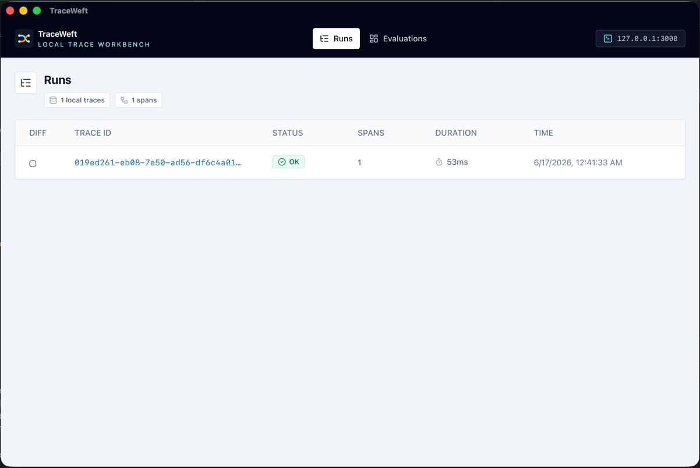
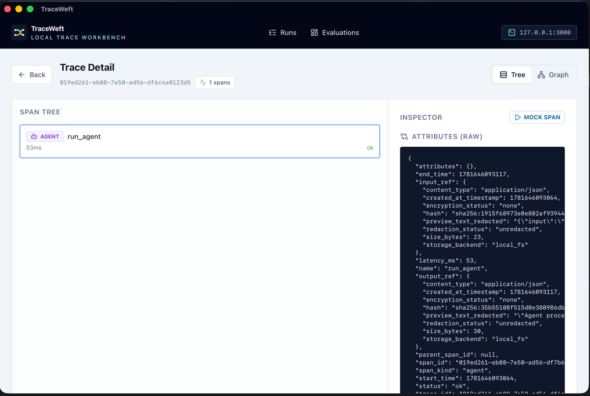
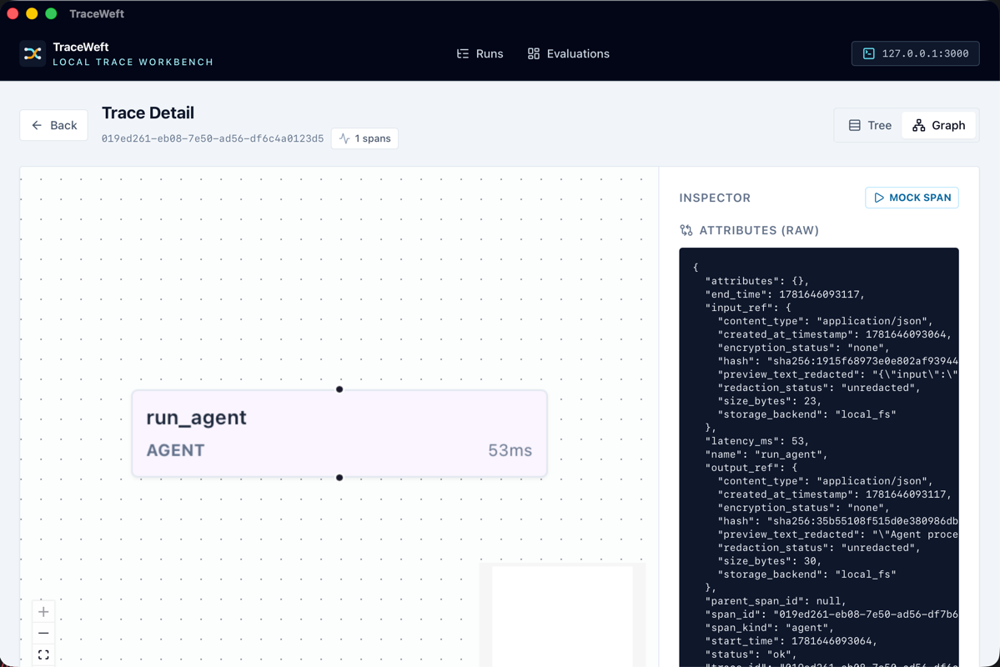

# TraceWeft

[](https://www.rust-lang.org/)
[](https://www.rust-lang.org/)
[](https://doc.rust-lang.org/edition-guide/rust-2024/index.html)
[](https://github.com/kidoz/trace-weft/blob/main/LICENSE)

> TraceWeft is an open-source Rust-first observability and debugging toolkit for LLM agents. It captures model calls, tool calls, memory operations, retrievals, state transitions, checkpoints, handoffs, and errors as structured traces, then lets developers inspect, replay, diff, and export them through OpenTelemetry-compatible pipelines.
>
> TraceWeft is local-first by default: run a Rust agent, open the local debugger, and inspect the full execution without sending prompts or tool outputs to a SaaS service.

## Screenshots

The local trace workbench (`trace-weft dev` plus the web UI):



| Span tree & inspector | Trace graph |
| --- | --- |
|  |  |

## Install

TraceWeft is not yet published to crates.io. Depend on it by git, pinning a
revision for reproducible builds:

```toml
[dependencies]
trace-weft = { git = "https://github.com/kidoz/trace-weft", rev = "<commit-sha>" }
```

The SDK is `sqlite`-by-default (a SQLite mirror alongside the JSONL stream). For
a pure local-JSONL integrator that pulls no `sqlx`:

```toml
[dependencies]
trace-weft = { git = "https://github.com/kidoz/trace-weft", rev = "<commit-sha>", default-features = false }
```

Requires Rust 1.96+ (edition 2024). Install the CLI from a checkout:

```bash
cargo install --path crates/trace-weft-cli
```

## Quickstart

Initialize a recorder once at startup, then record spans. The recorder is a
process-wide singleton; `init_local` wires the JSONL + SQLite recorder and the
blob store for content capture.

```rust
use trace_weft::{CapturePolicy, LocalConfig, init_local};

#[tokio::main]
async fn main() -> anyhow::Result<()> {
    init_local(LocalConfig {
        database_path: "./.trace-weft/traces.jsonl".into(),
        sqlite_db_path: "./.trace-weft/traces.sqlite".into(),
        blob_dir: "./.trace-weft/blobs".into(),
        capture_content: CapturePolicy::RedactedPreview,
    })
    .await?;

    let answer = answer_question("why is the sky blue?".into()).await?;
    println!("{answer}");
    Ok(())
}
```

For tests and evaluation, swap in an in-memory store:

```rust
use std::sync::Arc;
use trace_weft::{eval::MemoryStore, init_custom};

let store = MemoryStore::new();
init_custom(Arc::new(store.clone()))?;
// ... run the agent, then assert over store.spans / store.events
```

To compile tracing in but disable it at runtime, use the no-op store:
`init_custom(Arc::new(trace_weft::NullStore))`.

## The builder — the primary API

`SpanBuilder` is the capable, imperative recorder. Build a span, set the rich
fields you have on hand, and wrap the work in `.run(...)`:

```rust
use trace_weft::{build_llm_call, CostEstimate, TokenUsage};

let answer = build_llm_call("chat_completion")
    .provider("anthropic")
    .model("claude-fable-5")
    .prompt_version("v3")
    .input_ref("prompt", &prompt)
    .token_usage(TokenUsage { input: 1200, output: 280, reasoning: None, breakdown: Default::default() })
    .cost(CostEstimate { currency: "USD".into(), amount: 0.012 })
    .cache_hit(false)
    .attribute("temperature", serde_json::json!(0.2))
    .run(|| async {
        // the real call
        client.complete(&prompt).await
    })
    .await?;
```

### What `.run` captures

`SpanBuilder::run(f)` executes the closure and records:

- **latency** — `start_time`/`end_time`/`latency_ms` around the closure;
- **status** — `Ok` on `Ok(_)`, `Error` on `Err(e)` (with `error_type` from
  `Debug` and a redacted message from `Display`);
- **parenting** — auto-links to the ambient span context (see below) unless you
  set one explicitly with `.with_parent(...)`;
- **replay** — short-circuits to a mocked value when replay is configured.

It does **not** infer inputs/outputs by itself — set `.input_ref(label, &value)`
or `.output_ref(label, &value)` for values you want captured under the active
`CapturePolicy` (or use the macros, which capture arguments and successful
returns for you). If you already have a content-addressed blob, use
`.input_blob_ref(blob_ref)` / `.output_blob_ref(blob_ref)`. For closures that
don't return `Result`, use `.run_infallible(|| async { ... })`.

Builder setters cover the high-value `SpanRecord` fields: `.provider()`,
`.model()`, `.prompt_version()`, `.tool_name()`, `.input_ref()`,
`.output_ref()`, `.token_usage()`, `.cost()`, `.cache_hit()`,
`.retrieval(query_hash, doc_refs)`, `.attribute(k, v)`, `.attributes(map)`.

### Wrapping an `LlmClient` / `Tool`

Wrap each trait method body in a builder call — the span kind matches the role:

```rust
#[async_trait::async_trait]
impl LlmClient for AnthropicClient {
    async fn complete(&self, req: Request) -> anyhow::Result<Response> {
        trace_weft::build_llm_call("complete")
            .provider("anthropic")
            .model(&req.model)
            .run(|| async { self.inner.complete(req).await })
            .await
    }
}

#[async_trait::async_trait]
impl Tool for KbSearch {
    async fn call(&self, query: String) -> anyhow::Result<Vec<Doc>> {
        trace_weft::build_tool("kb_search")
            .tool_name("kb_search")
            .run(|| async { self.search(query).await })
            .await
    }
}
```

## Macros

`#[agent]`, `#[tool]`, and `#[llm_call]` instrument a function (free function or
`impl`/trait-impl method, including `&self`) and record a span with the matching
`SpanKind`. They:

- set the correct span kind and `Error` status when the body returns `Err`;
- auto-link to the ambient span context, so nested instrumented calls form a
  tree with no manual ID threading;
- capture inputs/outputs under the configured `CapturePolicy` — every captured
  argument must be `Serialize`; opt an argument out with `#[trace(skip)]`.

```rust
use trace_weft::{agent, llm_call, tool};

struct ResearchAgent { client: AnthropicClient }

impl ResearchAgent {
    #[agent]
    async fn run(&self, question: String) -> anyhow::Result<String> {
        let plan = self.plan(&question).await?;       // child span, auto-parented
        self.draft(plan).await
    }

    #[llm_call]
    async fn plan(&self, question: &str, #[trace(skip)] api_key: &str) -> anyhow::Result<Plan> {
        // `question` is captured to input_ref; `api_key` is skipped
        self.client.plan(question, api_key).await
    }
}
```

Trait *definitions* carry no body, so annotate the concrete `impl`. The
instrumented function must be `async`.

### Capture policy

`CapturePolicy` (set via `LocalConfig.capture_content`) governs content capture:

| Policy | Behavior |
| --- | --- |
| `MetadataOnly` | No content captured (zero serialization cost). |
| `RedactedPreview` | Redacts content, stores it, sets a redacted preview. |
| `FullContentLocalOnly` / `FullContentExportable` | Stores full content while keeping the preview redacted. |

Captured content is hashed, written to the blob store, and referenced from the
span as `input_ref` / `output_ref`.

## Events

Spans have duration; **events** are point-in-time occurrences inside a span (a
retry, a budget check, a guardrail trip, an REPL step). Build one with `event`
and `.record()` it — it auto-links to the ambient span and gets a monotonic
ordering `seq`:

```rust
use trace_weft::{event, EventKind};

event(EventKind::Budget, "budget_check")
    .attribute("tokens_remaining", serde_json::json!(1500))
    .record()
    .await;
```

`EventKind`: `LlmCall`, `ToolCall`, `ReplExec`, `Rpc`, `Budget`, `Guardrail`,
`Retry`, `Termination`, `Log`, `Custom`.

## Ambient context

`SpanBuilder::run` and the macros install the current span as a task-local
parent for the duration of the body. Child spans and events created inside it
link automatically; `with_parent(trace_id, run_id, span_id)` is the explicit
override for cross-task / cross-thread handoffs. Construct IDs with
`TraceId::new()`, `SpanId::new()`, `RunId::new()` — no direct `uuid` dependency
required.

## Human-in-the-loop breakpoints

`SpanBuilder::wait_for_approval()` records the span as `PendingApproval`, blocks
until the UI/server approves or rejects, then resumes — a debugger-style
breakpoint for risky actions, and a differentiator over plain OpenTelemetry:

```rust
match build_tool("transfer_funds").wait_for_approval().await? {
    trace_weft::HitlResponse::Approved(args) => execute(args).await,
    trace_weft::HitlResponse::Rejected(reason) => bail!("rejected: {reason}"),
}
```

## Local Dev Workflow

Once your application produces traces into `.trace-weft/traces.sqlite`, inspect
them visually:

```bash
trace-weft dev          # starts the local axum API on :3000 (local-first)
```

`trace-weft dev` starts only the **API server** (port 3000 by default,
local-first auth). To view the React UI in a browser, run it against that API:

```bash
npm --prefix apps/web install
npm --prefix apps/web run dev   # Vite dev server on :5173, proxies /api → :3000
```

Then open `http://localhost:5173` for the Trace List, Span Tree, Waterfall, and
Replay/Diff UI. Alternatively, the desktop app (`apps/desktop`) bundles the
built UI and embeds the API server in one window.

The UI's API base is `import.meta.env.VITE_API_BASE` (empty by default → same
-origin `/api`, which the Vite dev server proxies); the desktop build sets it to
the embedded server's `http://127.0.0.1:3000`.

## Server: storage backends and authentication

The server query endpoints (`/api/traces`, `/api/traces/{id}`, `/api/evals`)
run against either backend, selected by the database URL:

- **SQLite** (default, local-first) — any path or `sqlite://` URL.
- **Postgres** — a `postgres://` / `postgresql://` URL. The schema is created on
  first connect and the same endpoints serve it with output matching SQLite. A
  local instance for development and the Postgres-backed tests is provided via
  `docker compose up -d postgres`; run the parity suite with `just test-pg`.

API-key authentication and per-project tenant isolation are configured via
environment variables:

- `TRACE_WEFT_API_KEYS` — comma-separated `raw_key:project_id` pairs. Keys are
  hashed (SHA-256) at startup and never stored in the clear; requests
  authenticate with `Authorization: Bearer <raw_key>`. Trace queries are scoped
  to the key's project, and ingested spans are stamped with it server-side.
- `TRACE_WEFT_DEV_MODE=1` — enable the dev bypass (no key required; queries span
  all tenants). The embedded local server (`trace-weft dev`, desktop app)
  defaults this **on** when no keys are configured; production `start_server`
  use defaults it **off**, rejecting unauthenticated requests with `401`.

OTLP/HTTP JSON ingestion (`/v1/traces`) decodes payloads with the
`opentelemetry-proto` types, preserving original trace/span/parent IDs and
returning `400` for malformed bodies.

## Crate Layout

- `crates/trace-weft` - main user-facing SDK facade (builder, macros, events, capture, HITL, replay)
- `crates/trace-weft-core` - IDs, schemas, span/event types, redaction traits
- `crates/trace-weft-macros` - proc macros: `#[agent]`, `#[tool]`, `#[llm_call]`
- `crates/trace-weft-otel` - OpenTelemetry export/import bridge
- `crates/trace-weft-openinference` - OpenInference compatibility mapping
- `crates/trace-weft-recorder` - local JSONL/SQLite/blob recorder (`sqlite` feature, on by default)
- `crates/trace-weft-ingest` - OTLP ingestion via `opentelemetry-proto`, preserving original IDs
- `crates/trace-weft-server` - axum API, SQLite + Postgres query layer, API-key auth and tenant scoping
- `crates/trace-weft-cli` - CLI: dev, import, export, replay
- `apps/web` - React / TypeScript / Vite UI
```
